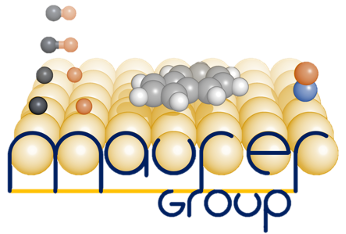

# Maurer group documentation

{ align=right width=250 }

Welcome to the Maurer group documentation!

This site contains guides and tutorials to help you get up to speed with the software and scripts used within our group.

## Contributing

It is highly encouraged for you to add new resources, guides and tutorials to help make the group documentation even more useful.
By developing the content here you will help not only future generations within our group, but also yourself when you inevitably forget how you did something the first time round.

### What to include?

The content of this website is created by the group, for the group.
The information to include is completely up to *you*.
If somebody asks how to do something, consider whether others may also be interested.
When you do something new for the first time, create a guide so you don't forget how to do it.
Even if you believe that no one else will find it useful, the content that you create now will still be available for many years to come, where it may become relevant to your successor.

Suggestions:

- Explanation of technical topics (*Physical chemistry, software development*)
- Tutorials (*Creating figures and images, working with software packages and languages*)
- How-to guides (*Installing and compiling software, running specific simulations*)
- Reference information (*Reading materials, HPC details*)

!!! warning

    Currently the website is publicly accessible.
    This means that you should consider whether you are publishing any sensitive information before adding it to the website.
    If in doubt, ask someone else to make sure.

### How to contribute

!!! info

    This site is created using [Material for MkDocs](https://squidfunk.github.io/mkdocs-material/).
    Each page is generated from basic Markdown files with a few extensions.
    Settings for the document theme and the enabled extensions can be modified in the `mkdocs.yml` file.

#### Editing existing pages

Each page is generated from a single Markdown file that you can directly edit from GitHub by clicking the edit icon in the top right of each page.
If you see something that is incorrect or seems outdated, please take the short amount of time to fix it.

#### Creating new pages

The easiest way to add new files is through GitHub.
Simply click the :material-plus: icon and upload or create a new file.
Once the file has been added to the repository, add a new line to the `nav:` section in the `mkdocs.yml` file found at the top level of the GitHub repository.

!!! tip "Local testing"

    If you are making significant modifications or just want to preview your changes before uploading to GitHub, you have the option to build the site locally.
    To do this, [install Material for MkDocs](https://squidfunk.github.io/mkdocs-material/getting-started/), then clone the repository and run `mkdocs serve` from the terminal.
    Navigate your browser to the address printed in the terminal and you should see the site.
    Whenever you make an edit your changes will appear immediately.
