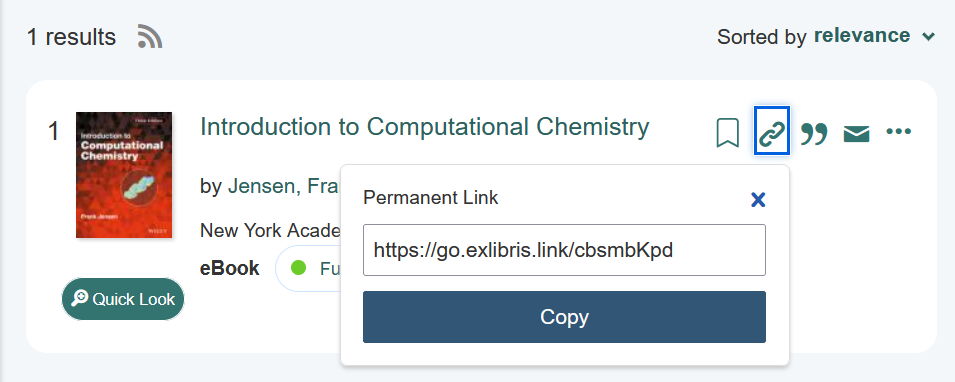

# Recommended reading

This page provides a list of reading materials that group members have found useful.

!!! tip "Adding new resources"

    If you encounter a good book, consider adding it to the list.
    Be sure to include a brief description of why you found the book useful and if possible, a link to where the resource can be found.

    <figure markdown>
        { width=500 }
        <figcaption>If the book is available from the Warwick library, include a permalink to the search result.
    </figure>
## Physical & Theoretical Chemistry

- [A comprehensive source of various physical and theoretical chemistry books](https://chem.libretexts.org/Bookshelves/Physical_and_Theoretical_Chemistry_Textbook_Maps)
- [Introduction to Computational Chemistry, Frank Jensen](https://go.exlibris.link/cbsmbKpd)

## Quantum Chemistry and Density Functional Theory

- Molecular Vibrations, Wilson, Decius, Cross, Dover Books
- Essentials of Computational Chemistry, Christopher Cramer, Wiley
- Density Functional Theory, Engel and Dreizler, Springer
- Quantum Chemistry, Ira N. Levine, Pearson
- Advances in Density-Functional Calculations for Materials Modeling, Ann. Rev. Mater. Res. 2019, Maurer et al.
- The Fokker-Planck Equation, H. Risken
- Modern Quantum Chemistry: Introduction to Advanced Electronic Structure Theory, A. Szabo, N. Ostlund
- Key Concepts in Time-Dependent Density-Functional Theory, R. van Leeuwen

## Condensed Matter Simulation and Molecular Simulation

- Electronic Structure, Richard M. Martin, Cambridge University Press
- Free Energy Calculations, Chipot, Springer
- Understanding Molecular Simulation, Frenkel and Smit, Academic Press

## Surface Science and electrochemistry

- A chemist's view on solids and surfaces, R. Hoffmann
- Theoretical Surface Science, Axel Gross, Springer
- Dynamics of Gas-Surface Interactions, Springer
- Ultrafast dynamics of electrons and phonons, Review article
- Interfacial Electrochemistry, Wolfgang Schmickler, Springer
- Adsorbate Electronic Structure and Bonding on Metal Surfaces, Anders Nilsson and Lars Pettersson
- Surface Crystallography: Structures and Notation
- Surface Geometric and Electronic Structure: A Primer
- Electronic and Optical Properties of Conjugated Polymers, William Bradford, Oxford Science
- Crystallography and Surface Science, Klaus Hermann, Wiley

## DFT Calculations and Experiments on Hybrid Organic-Inorganic Interfaces

- Book chapter "Modelling Organic-Inorganic Hybrid Interfaces", O. Hofmann and E. Zojer
- Adsorption structures and energetics of molecules on metal surfaces: Bridging experiment and theory, Maurer et al., Progr. Surf. Sci. 91, 72-100 (2016)

## Machine Learning

- Algebra, Topology, Differential Calculus, and Optimization Theory For Computer Science and Machine Learning, Jean Gallier and Jocelyn Quaintance
- Course Notes on Optimization for Machine Learning, Gabriel Peyré
- Statistical Mechanics of Deep Learning, Annu. Rev. Condens. Matter Phys., 2020, Bahri et al.
